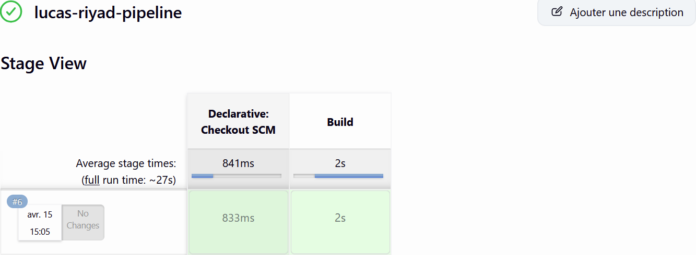
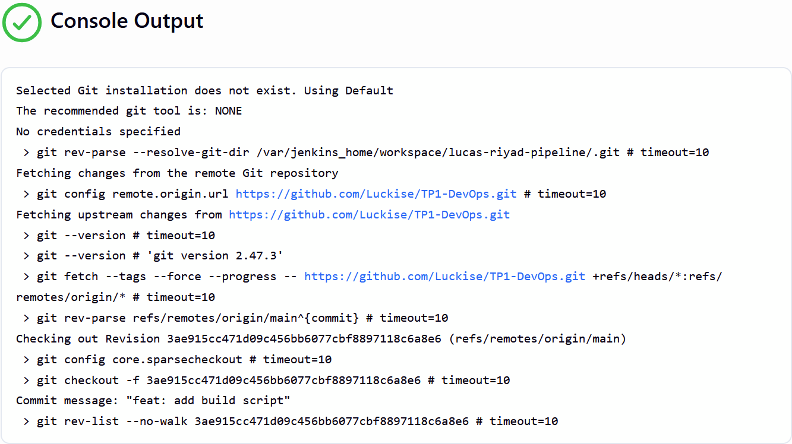
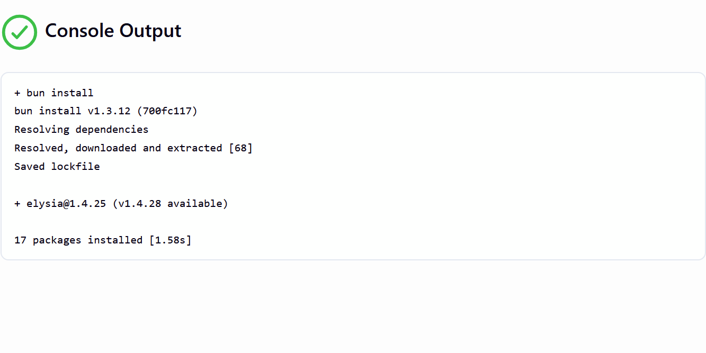
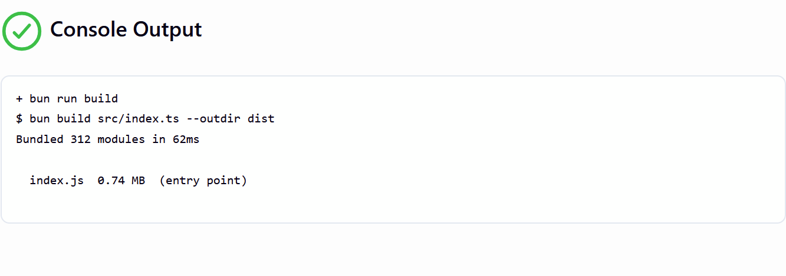
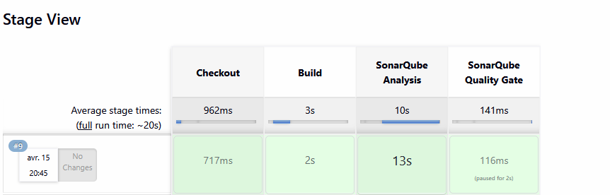
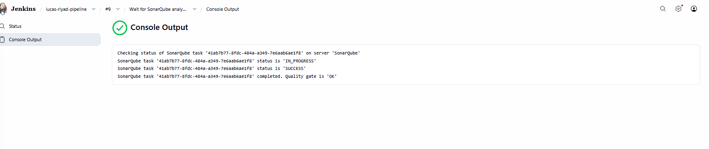

# TP1-DevOps
TP1 pour Lucas et Riyd






## Logs detaillé stage sonarQube analyse
```bash
+ /var/jenkins_home/tools/hudson.plugins.sonar.SonarRunnerInstallation/sonar-scanner/bin/sonar-scanner -Dsonar.projectKey=lucas-riyad -Dsonar.projectName=TP1-DevOps -Dsonar.sources=src -Dsonar.exclusions=dist/**,node_modules/**
18:45:09.416 INFO  Scanner configuration file: /var/jenkins_home/tools/hudson.plugins.sonar.SonarRunnerInstallation/sonar-scanner/conf/sonar-scanner.properties
18:45:09.421 INFO  Project root configuration file: NONE
18:45:09.443 INFO  SonarScanner CLI 8.0.1.6346
18:45:09.450 INFO  Linux 6.6.87.2-microsoft-standard-WSL2 amd64
18:45:12.093 INFO  Communicating with SonarQube Community Build 26.2.0.119303
18:45:12.093 INFO  JRE provisioning: os[linux], arch[x86_64]
18:45:12.417 INFO  Starting SonarScanner Engine...
18:45:12.417 INFO  Java 21.0.9 Eclipse Adoptium (64-bit)
18:45:15.285 INFO  Load global settings
18:45:15.352 INFO  Load global settings (done) | time=66ms
18:45:15.355 INFO  Server id: 147B411E-AZ2SOR9xjTX9Lt3DtvPx
18:45:15.363 INFO  Loading required plugins
18:45:15.363 INFO  Load plugins index
18:45:15.375 INFO  Load plugins index (done) | time=11ms
18:45:15.375 INFO  Load/download plugins
18:45:15.398 INFO  Load/download plugins (done) | time=22ms
18:45:15.654 INFO  Process project properties
18:45:15.665 INFO  Process project properties (done) | time=11ms
18:45:15.675 INFO  Project key: lucas-riyad
18:45:15.676 INFO  Base dir: /var/jenkins_home/workspace/lucas-riyad-pipeline
18:45:15.676 INFO  Working dir: /var/jenkins_home/workspace/lucas-riyad-pipeline/.scannerwork
18:45:15.687 INFO  Load project settings for component key: 'lucas-riyad'
18:45:15.701 INFO  Load project settings for component key: 'lucas-riyad' (done) | time=14ms
18:45:15.722 INFO  Load quality profiles
18:45:15.772 INFO  Load quality profiles (done) | time=50ms
18:45:15.786 INFO  Auto-configuring with CI 'Jenkins'
18:45:15.820 INFO  Load active rules
18:45:16.160 INFO  Load active rules (done) | time=340ms
18:45:16.168 INFO  Load analysis cache
18:45:16.185 INFO  Load analysis cache (508 bytes) | time=18ms
18:45:16.310 INFO  Preprocessing files...
18:45:16.395 INFO  1 language detected in 1 preprocessed file (done) | time=85ms
18:45:16.396 INFO  0 files ignored because of inclusion/exclusion patterns
18:45:16.396 INFO  0 files ignored because of scm ignore settings
18:45:16.397 INFO  Loading plugins for detected languages
18:45:16.397 INFO  Load/download plugins
18:45:16.401 INFO  Load/download plugins (done) | time=3ms
18:45:16.553 INFO  Load project repositories
18:45:16.625 INFO  Load project repositories (done) | time=72ms
18:45:16.645 INFO  Indexing files...
18:45:16.645 INFO  Project configuration:
18:45:16.646 INFO    Excluded sources: dist/**, node_modules/**
18:45:16.653 INFO  1 file indexed (done) | time=7ms
18:45:16.654 INFO  Quality profile for ts: Sonar way
18:45:16.654 INFO  ------------- Run sensors on module TP1-DevOps
18:45:16.682 INFO  Load metrics repository
18:45:16.703 INFO  Load metrics repository (done) | time=21ms
18:45:17.007 INFO  Sensor IaC hadolint report Sensor [iac]
18:45:17.008 INFO  Sensor IaC hadolint report Sensor [iac] (done) | time=1ms
18:45:17.008 INFO  Sensor Java Config Sensor [iac]
18:45:17.012 INFO  There are no files to be analyzed for the Java language
18:45:17.013 INFO  Sensor Java Config Sensor [iac] (done) | time=5ms
18:45:17.013 INFO  Sensor IaC Docker Sensor [iac]
18:45:17.013 INFO  There are no files to be analyzed for the Docker language
18:45:17.013 INFO  Sensor IaC Docker Sensor [iac] (done) | time=1ms
18:45:17.013 INFO  Sensor JavaScript/TypeScript analysis [javascript]
18:45:17.240 INFO  Detected os: Linux arch: amd64 alpine: false. Platform: LINUX_X64
18:45:17.240 INFO  Deploy location /root/.sonar/js/node-runtime, tagetRuntime: /root/.sonar/js/node-runtime/node,  version: /root/.sonar/js/node-runtime/version.txt
18:45:17.247 INFO  Using embedded Node.js runtime.
18:45:17.247 INFO  Using Node.js executable: '/root/.sonar/js/node-runtime/node'.
18:45:19.027 INFO  Memory configuration: OS (32055 MB), Node.js (4288 MB).
18:45:19.079 INFO  WebSocket client connected on /ws
18:45:19.081 INFO  Plugin version: [11.8.0.37897]
18:45:20.705 INFO  Using generated tsconfig.json file using wildcards /tmp/tsconfig-YB3ulH.json
18:45:20.601 INFO  Found 1 tsconfig.json file(s): [/tmp/tsconfig-YB3ulH.json]
18:45:20.602 INFO  1 source file to be analyzed
18:45:20.602 INFO  Creating TypeScript program
18:45:20.602 INFO  TypeScript(5.9.3) configuration file /tmp/tsconfig-YB3ulH.json
18:45:20.602 INFO  1/1 source file has been analyzed
18:45:20.645 INFO  Hit the cache for 0 out of 1
18:45:20.646 INFO  Miss the cache for 1 out of 1: ANALYSIS_MODE_INELIGIBLE [1/1]
18:45:20.646 INFO  Sensor JavaScript/TypeScript analysis [javascript] (done) | time=3633ms
18:45:20.646 INFO  Sensor CSS Rules [javascript]
18:45:20.646 INFO  No CSS, PHP, HTML or VueJS files are found in the project. CSS analysis is skipped.
18:45:20.646 INFO  Sensor CSS Rules [javascript] (done) | time=0ms
18:45:20.647 INFO  Sensor TextAndSecretsSensor [text]
18:45:20.654 INFO  Available processors: 20
18:45:20.654 INFO  Using 20 threads for analysis.
18:45:20.869 INFO  The property "sonar.tests" is not set. To improve the analysis accuracy, we categorize a file as a test file if any of the following is true:
  * The filename starts with "test"
  * The filename contains "test." or "tests."
  * Any directory in the file path is named: "doc", "docs", "test", "tests", "mock" or "mocks"
  * Any directory in the file path has a name ending in "test" or "tests"

18:45:20.888 INFO  Start fetching files for the text and secrets analysis
18:45:20.894 INFO  Using Git CLI to retrieve dirty files
18:45:20.920 INFO  Retrieving language associated files and files included via "sonar.text.inclusions" that are tracked by git
18:45:20.921 INFO  Starting the text and secrets analysis
18:45:20.923 INFO  1 source file to be analyzed for the text and secrets analysis
18:45:20.933 INFO  1/1 source file has been analyzed for the text and secrets analysis
18:45:20.936 INFO  Sensor TextAndSecretsSensor [text] (done) | time=290ms
18:45:20.939 INFO  ------------- Run sensors on project
18:45:21.035 INFO  Sensor Zero Coverage Sensor
18:45:21.039 INFO  Sensor Zero Coverage Sensor (done) | time=3ms
18:45:21.039 INFO  ------------- Gather SCA dependencies on project
18:45:21.043 INFO  Dependency analysis skipped
18:45:21.049 INFO  CPD Executor 1 file had no CPD blocks
18:45:21.049 INFO  CPD Executor Calculating CPD for 0 files
18:45:21.049 INFO  CPD Executor CPD calculation finished (done) | time=0ms
18:45:21.056 INFO  SCM revision ID '8d0081713562bad0c6efa9001d9a193f4b0e3040'
18:45:21.127 INFO  Analysis report generated in 73ms, dir size=260.5 kB
18:45:21.137 INFO  Analysis report compressed in 10ms, zip size=29.0 kB
18:45:21.155 INFO  Analysis report uploaded in 17ms
18:45:21.156 INFO  ANALYSIS SUCCESSFUL, you can find the results at: http://sonarqube:9000/dashboard?id=lucas-riyad
18:45:21.156 INFO  Note that you will be able to access the updated dashboard once the server has processed the submitted analysis report
18:45:21.156 INFO  More about the report processing at http://sonarqube:9000/api/ce/task?id=41ab7b77-8fdc-484a-a349-7e6aab6ae1f8
18:45:21.250 INFO  Analysis total time: 5.819 s
18:45:21.251 INFO  SonarScanner Engine completed successfully
18:45:21.597 INFO  EXECUTION SUCCESS
18:45:21.598 INFO  Total time: 12.213s
```

## Logs detaillé QualityGate 

