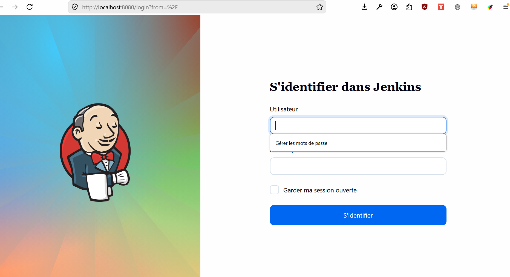

# TP1-DevOps
TP1 pour Lucas et Riyad

## Partie 1 : Installation et Configuration de Jenkins

### Installer Jenkins en suivant la doc officiel :

Nous avons utilisé l'image docker de jenkins 

### Accéder à Jenkins :

## Pipeline Jenkins