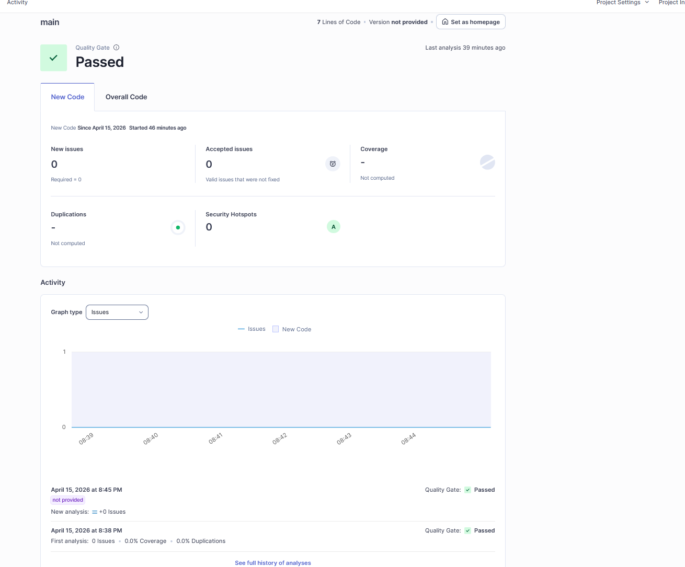
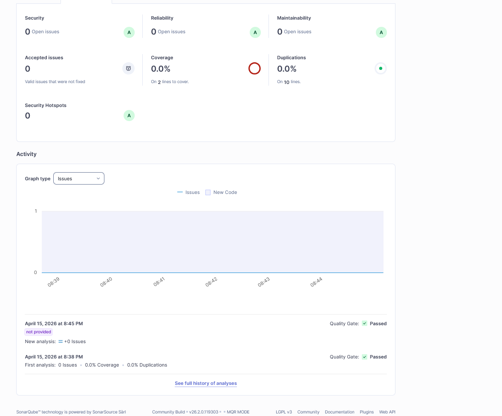
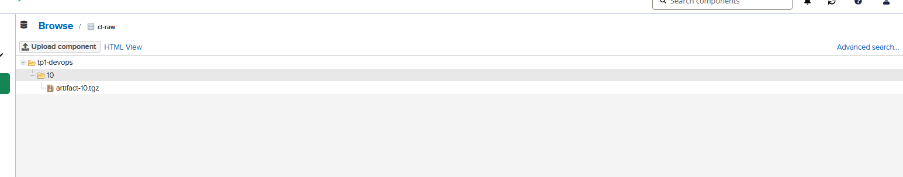
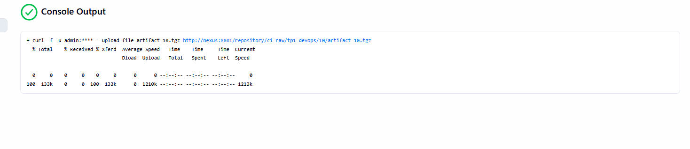
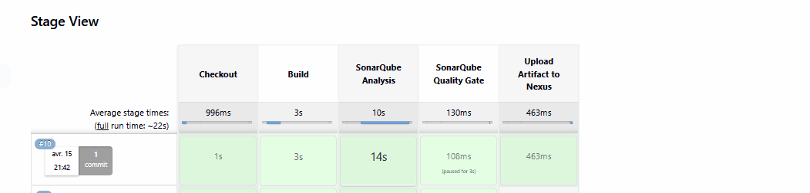

# TP1 DevOps

Ce projet met en place une pipeline Jenkins complète pour une application javascript/typescript en utilisant Bun (Runtime Javascript/Typescript)

les étapes sont les suivantes :

- build de l’application
- analyse qualité SonarQube
- publication d’un artefact dans Nexus

## Objectif du livrable

Le livrable demandé est de démontrer que l'artefact est bien:

1. construit par Jenkins
2. analysé par SonarQube
3. validé par le Quality Gate
4. envoyé dans Nexus

## Stack utilisée

- Jenkins pour l’orchestration CI
- Bun pour le build de l’application
- SonarQube pour l’analyse de qualité
- Nexus Repository pour l’archivage de l’artefact
- Docker Compose pour lancer les services

## Architecture

Les services utilisés dans le `docker-compose.yml` sont:

- Jenkins sur le port `8080`
- SonarQube sur le port `9000`
- Nexus sur le port `8081`

Jenkins et les services de qualité sont reliés via le réseau Docker `ci-network`.

## Pipeline Jenkins

La pipeline définie dans [Jenkinsfile](Jenkinsfile) exécute les stages suivants:

1. `Checkout` : récupération du code source depuis Git
2. `Build` : installation des dépendances Bun et génération du dossier `dist`
3. `SonarQube Analysis` : lancement du scanner SonarQube
4. `SonarQube Quality Gate` : attente du résultat du Quality Gate
5. `Upload Artifact to Nexus` : création d’une archive `.tgz` puis upload dans Nexus

## Configuration requise

### Jenkins

- Configurer un serveur SonarQube nommé `SonarQube`
- Configurer l’outil `sonar-scanner`
- Créer une credential Jenkins avec l’ID `nexus-credentials`

### SonarQube

- Créer ou autoriser le projet `lucas-riyad`
- Donner au compte utilisé par Jenkins le droit `Execute Analysis`
- Configurer le webhook vers Jenkins pour le `waitForQualityGate`

### Nexus

- Créer un repository raw hosted nommé `ci-raw`
- Créer un utilisateur de déploiement ou réutiliser `admin` pour le test
- Donner les droits de push sur le repository

## Vérification attendue

Quand la pipeline réussit, on doit observer:

- un rapport d’analyse dans SonarQube
- un Quality Gate passé
- un artefact déposé dans Nexus au chemin:

`tp1-devops/<numéro-de-build>/artifact-<numéro-de-build>.tgz`

## Captures disponibles

Les captures d’écran présentes dans le dépôt servent de preuve pour les livrables demandés.

### 1. Vue générale de la pipeline


### 2. Stage Checkout


### 3. Stage Build


### 4. Stage SonarQube


### 5. Analyse SonarQube





### 6. Quality Gate


### 7. Upload Nexus





### 8. Pipeline finale réussie



Ces captures montrent, dans l’ordre, le build, l’analyse qualité, la validation du Quality Gate et la publication dans Nexus.

## Commande de lancement

La stack peut être démarrée avec:

```bash
docker compose up -d
```

Ensuite, lancer la pipeline depuis Jenkins.


